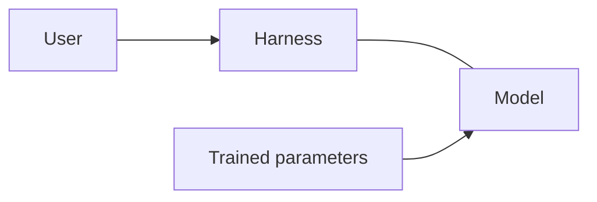
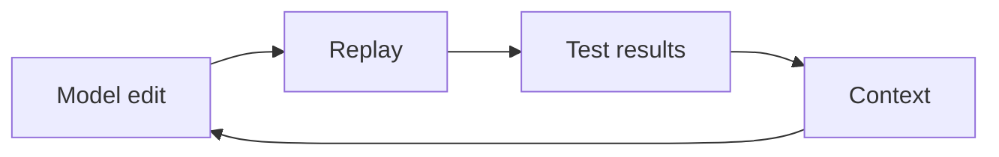
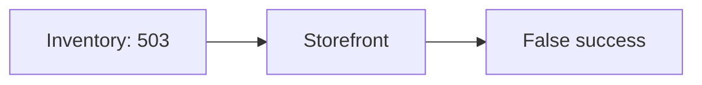

# How runtime feedback improves AI coding

An AI coding tool can write a change and a passing test that both get the API wrong. Recorded traffic gives it real requests and responses to work from. Replay checks what the changed code actually does with them.

## The model and the harness



The model generates code using patterns learned during training and the context you give it now. It can reason about how code should behave. That reasoning can still be wrong, and generating code does not run it.

The **harness** is the software around the model. It combines your request with instructions, relevant files, and tool results. It manages the conversation and executes allowed tool calls. The model proposes edits and commands; the harness applies edits, runs commands, and sends the results back. Together, they form the coding agent.

Reading an API client tells the model how the client expects a response to look. It does not tell the model what the API returns today, what is in the database, or which requests time out. The model can request commands through the harness to check those assumptions. Until it does, those details may be assumptions.

## What the context window holds

The context window is the token budget for one model request. Tokens are chunks of text or code; images and other supported inputs also use tokens.

[Liu et al., *Agentic Coding in the Wild*](https://arxiv.org/html/2608.00101v1), Section 5.1, Figure 11, reports these average input-token shares across 13.5 million GitHub Copilot sessions from the first week of June 2026:

| Content | Share of input tokens |
| --- | ---: |
| Conversation history | 48% |
| Function-call messages | 28% |
| System prompt | 14% |
| Repository instructions and other context | 10% |

These are measured Copilot averages, not recommended allocations. They exclude output and do not isolate traffic or test results.

**Cached tokens are a subset of input tokens, not extra capacity.** Prompt caching reuses work from an earlier request. A cache hit can reduce cost and latency, but those tokens still occupy the context window. For example, 20,000 cached input tokens plus 5,000 uncached input tokens occupy 25,000 tokens before output. See [OpenAI's prompt-caching guide](https://developers.openai.com/api/docs/guides/prompt-caching) and [Anthropic's context accounting](https://platform.claude.com/docs/en/build-with-claude/context-windows).

Input plus generated output, including reasoning, must fit within the context limit. Models can also have a separate output limit. More input leaves less room for output within the total budget.

The harness assembles the input. Files on disk take no context space until their contents are supplied; trained model parameters are outside this budget too. After a tool runs, its result can enter the next request as input. That is how a failed replay can inform the next edit.

As the conversation grows, the harness may select, summarize, or drop older material. Caching does not prevent the window from filling. Traffic shares the same budget and does not retrain the model. See the context-window docs from [OpenAI](https://developers.openai.com/api/docs/guides/conversation-state#managing-the-context-window) and [Anthropic](https://docs.claude.com/en/docs/build-with-claude/context-windows).

## How traffic and test results help

Before editing, the model can ask the harness to read captured requests and responses. These show actual field names, value types, and calls between services. For example, a response might contain a null value where the model expected a string. That example gives it a reason to handle the null case.

After editing, the harness can run the application with recorded responses as mocks and replay requests against it. A failed comparison or assertion tells the model what went wrong. That result enters the next request, so the model can use it to diagnose the failure and revise the code.



*Feedback loop: the harness applies the edit, runs replay, and returns the test results. The model uses that feedback to guide its next edit.*

The model decides whether another edit is needed. This loop changes its context; its trained parameters stay the same. It is execution feedback, rather than a reinforcement-learning training step. See how tool results are returned in [OpenAI](https://developers.openai.com/api/docs/guides/function-calling) and [Anthropic](https://docs.claude.com/en/docs/agents-and-tools/tool-use/overview).

## Example: a downstream service is unavailable

A storefront asks an inventory service for stock levels. If inventory is down, it should use the last good value and mark it as cached. If nothing is cached, it should return an error. This is the scenario in the [chaos lab](labs/chaos/README.md).

This example uses `proxymock mock` with chaos injection and curl requests in place of the `proxymock replay` step shown above; the feedback loop is the same.

The lab includes a bug: the [HTTP client](labs/chaos/cmd/app/main.go) checks for connection errors but never checks the response status. A 503 with valid JSON is treated as success. Tests using only 200 responses would miss it.



The lab starts with a healthy recording and injects 503 responses from inventory. The recorded body stays intact. The [saved evidence](labs/chaos/evidence/broken-storefront.jsonl) shows the storefront still returning `degraded:false` and `source:"inventory"`, even though the dependency failed. The outage is injected, not a failure found in the original capture.

That gives the agent a concrete contradiction to investigate: inventory failed, but the storefront claims fresh data. The fix is to check the HTTP status before accepting the body, so the existing fallback can run.

From `labs/chaos`, start the failure case:

```bash
make mock-chaos
```

In a second terminal, also from `labs/chaos`:

```bash
make baseline
make chaos-evidence
```

These commands print the storefront response and the injected inventory status. See the [lab prerequisites](labs/chaos/README.md#prerequisites) before running them.

After the fix, stop `make mock-chaos` and use `make mock-flaky` to exercise both success and failure. Check these requirements:

| Inventory response | Required storefront behavior |
| --- | --- |
| Success | Fresh stock, `source:"inventory"`, `degraded:false` |
| Failure, with cached stock | Cached stock, `source:"cache"`, `degraded:true` |
| Failure, empty cache | HTTP 503, `inventory unavailable` |

A plain response diff against the healthy recording would miss this bug because the broken app returns the same successful body. The test must check the fallback requirements against the dependency's actual status. The harness returns those observations to the model, which can revise the fix and test again. Traffic makes the failure repeatable; the assertions define what correct behavior means.

## Choose useful traffic

Keep the full recording on disk. Give the model relevant RRPairs (proxymock's request/response pair files) and test results as needed. Different payloads and failure cases add useful coverage; repeated copies of the same successful request add little.

Replay checks the cases you recorded. It cannot prove the original behavior was correct or cover every production condition. Keep tests for the intended behavior, and use logs, traces, or profiles when responses alone cannot explain a failure. Remove credentials and personal data before sharing captures with a model.
