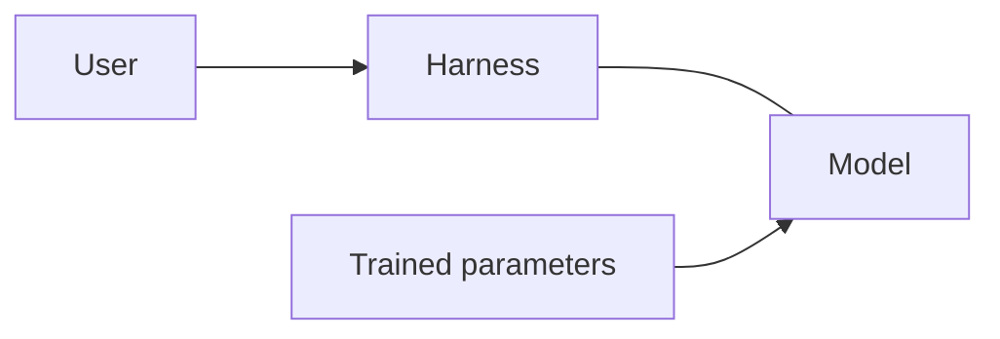
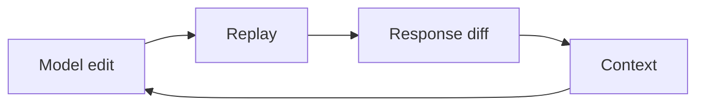
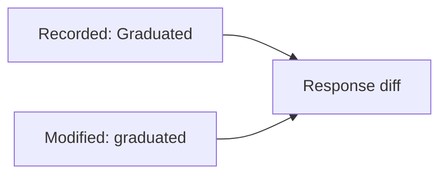

# How runtime feedback improves AI coding

An AI coding tool can write a change and a passing test that both get the API wrong. Recorded traffic gives it real requests and responses to work from. Replay checks what the changed code actually does with them.

## The model and the harness



The model generates code using patterns learned during training and the context you give it now. It can reason about how code should behave. That reasoning can still be wrong, and generating code does not run it.

The **harness** is the software around the model. It combines your request with instructions, relevant files, and tool results. It manages the conversation and executes allowed tool calls. The model proposes edits and commands; the harness applies edits, runs commands, and sends the results back. Together, they form the coding agent.

Reading an API client tells the model how the client expects a response to look. It does not tell the model what the API returns today, what is in the database, or which requests time out. The model can request commands through the harness to check those assumptions. Until it does, those details may be assumptions.

## What the context window holds

The context window is the token budget for one model request. Tokens are chunks of text or code; images and other supported inputs also use tokens.

| Content | Examples | Token budget |
| --- | --- | --- |
| System and developer instructions | Rules supplied by the platform and harness | Input |
| User context | Your request, goals, constraints, and examples | Input |
| Conversation history | Earlier messages and retained tool calls | Input |
| Files and recordings | Selected code, documentation, attachments, and traffic | Input |
| Tool definitions | Available tools and their arguments | Input |
| Tool results | File contents, command output, and test results | Input |
| Cached input | Reused parts of the prompt, such as unchanged instructions or history | Still input; counted once |
| Reasoning | Internal reasoning generated for this request, when used | Output |
| Response | Generated text, code, and tool calls | Output |

**Cached tokens are a subset of input tokens, not extra capacity.** Prompt caching reuses work from an earlier request. A cache hit can reduce cost and latency, but those tokens still occupy the context window. For example, 20,000 cached input tokens plus 5,000 uncached input tokens occupy 25,000 tokens before output. See [OpenAI's prompt-caching guide](https://developers.openai.com/api/docs/guides/prompt-caching) and [Anthropic's context accounting](https://platform.claude.com/docs/en/build-with-claude/context-windows).

Input plus generated output, including reasoning, must fit within the context limit. Models can also have a separate output limit. More input leaves less room for output within the total budget.

The harness assembles the input. Files on disk take no context space until their contents are supplied; trained model parameters are outside this budget too. After a tool runs, its result can enter the next request as input. That is how a failed replay can inform the next edit.

As the conversation grows, the harness may select, summarize, or drop older material. Caching does not prevent the window from filling. Traffic shares the same budget and does not retrain the model. See the context-window docs from [OpenAI](https://developers.openai.com/api/docs/guides/conversation-state#managing-the-context-window) and [Anthropic](https://docs.claude.com/en/docs/build-with-claude/context-windows).

## How traffic and test results help

Before editing, the model can ask the harness to read captured requests and responses. These show actual field names, value types, and calls between services. For example, a response might contain a null value where the model expected a string. That example gives it a reason to handle the null case.

After editing, the harness can run the application with recorded responses as mocks and replay requests against it. A failed comparison tells the model what changed. That result enters the next request, so the model can use it to diagnose the failure and revise the code.



*Feedback loop: the harness applies the edit, runs replay, and returns the response diff. The model uses that feedback to guide its next edit.*

The model decides whether another edit is needed. This loop changes its context; its trained parameters stay the same. It is execution feedback, rather than a reinforcement-learning training step. See how tool results are returned in [OpenAI](https://developers.openai.com/api/docs/guides/function-calling) and [Anthropic](https://docs.claude.com/en/docs/agents-and-tools/tool-use/overview).

## An example in mock-lab

The [Go app](languages/go/main.go) groups projects by maturity at `GET /api/stats`. Its [recorded API response](lab/proxymock/recording/localhost/2026-06-25_18-56-37.062363Z.md) contains:

```json
{"by_maturity":{"Graduated":16,"Incubating":5,"Sandbox":3},"total":24}
```

Suppose an agent refactors the code and lowercases those keys. It also writes a test expecting `"graduated"`. The test passes, but a client looking for `"Graduated"` breaks.



Reading the recording would show the existing casing before the edit. Replay could catch the change afterward, even though both versions return HTTP 200.

To run the recorded cases, start the app from `languages/go`:

```bash
proxymock mock --in ../../lab/proxymock/recording -- go run .
```

In a second terminal, also from `languages/go`, run:

```bash
proxymock replay --in ../../lab/proxymock/recording --test-against http://localhost:8080
```

Replay writes results for each request to `replay-verdict.json` in its output directory. With the hypothetical lowercase change, the body diff would show a removed `Graduated` key and an added `graduated` key. The agent now has a specific failure to fix. The unchanged app should not show that difference.

## Choose useful traffic

Keep the full recording on disk. Give the model relevant RRPairs (proxymock's request/response pair files) and test results as needed. Different payloads and failure cases add useful coverage; repeated copies of the same successful request add little.

Replay checks the cases you recorded. It cannot prove the original behavior was correct or cover every production condition. Keep tests for the intended behavior, and use logs, traces, or profiles when responses alone cannot explain a failure. Remove credentials and personal data before sharing captures with a model.
