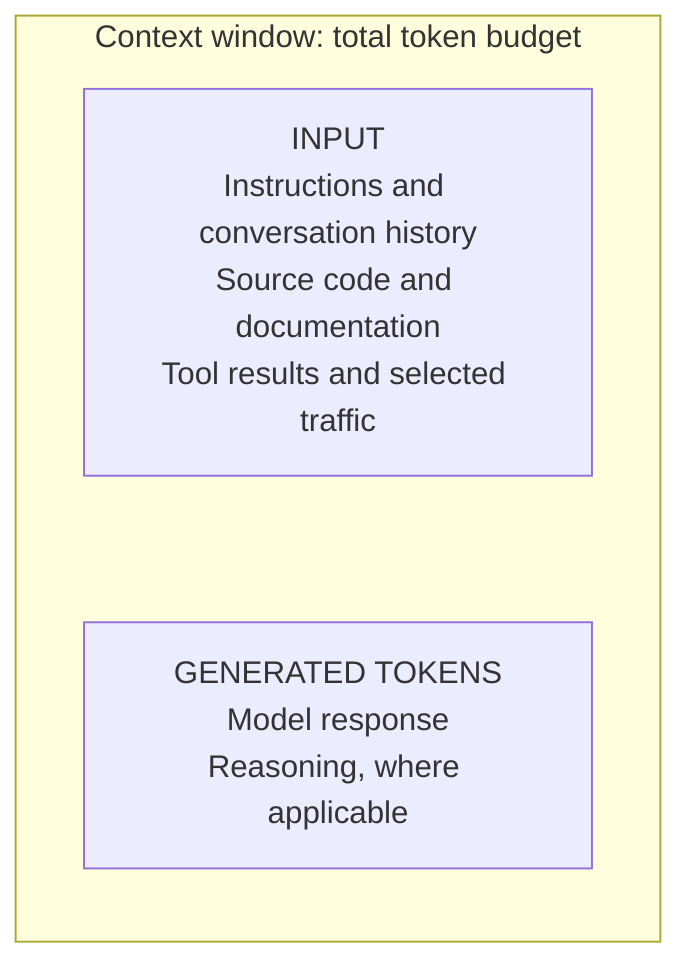

# Traffic recordings as context for coding agents

Recorded requests and responses document runtime behavior: payload formats, status codes, and interactions with downstream services. Providing relevant recordings to a coding agent can reduce incorrect assumptions about those interfaces.

## What occupies the context window?

A context window is the maximum number of tokens a model can process in a single inference request. Tokens are units produced by encoding text, including source code. The token budget covers the input and generated output, including reasoning tokens for models that use them. See [OpenAI's context-window documentation](https://developers.openai.com/api/docs/guides/conversation-state#managing-the-context-window).

The diagram shows categories, not relative sizes. Repository files and recordings consume input tokens only when their contents are included in the model request, for example through a file-read tool. Adding traffic consumes the existing token budget; it does not increase the context limit or update the model's weights.

## Why can traffic improve generated code?

Source code describes the implementation. Recorded traffic adds examples of its runtime inputs and outputs, including responses from dependencies whose implementations may be unavailable. These examples help the model infer data formats and request dependencies from observed behavior.

In mock-lab, the authentication and order sequence illustrates this: a token response supplies the bearer token for subsequent requests, and the create-order response supplies the ID used to retrieve the order. Both values change between runs. The recording exposes these dependencies so the agent can configure value substitution for replay instead of reusing expired or nonexistent values.

Recordings also support validation outside the model: proxymock serves recorded downstream responses as mocks and replays inbound requests against the modified application. Test results can then be included in the next model request. Passing replay validates the recorded cases under the configured comparisons; it does not prove correctness for untested inputs or establish that the recorded behavior meets the requirements.

## Select for coverage, not volume

Include requests relevant to the change, with distinct response schemas, status codes, and failure cases. Additional examples are useful when they expose behavior absent from the existing context. Duplicate requests consume tokens without adding coverage. Keep the full recording on disk and include selected RRPairs or test reports as needed. Redact credentials and personal data before supplying captures to a model.
