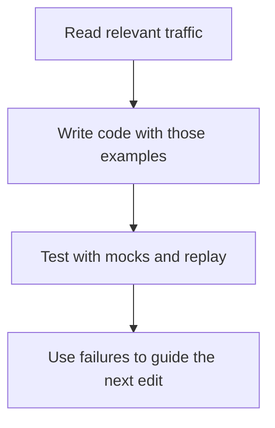

# Why traffic helps an AI coding agent

> Captured traffic gives a coding agent concrete examples of how an application behaves. Selected requests and responses help it write the change; mocks and replay let it check the result.

## What fits in the context window?

The context window is the model's limited working space for one response, measured in tokens (pieces of text or code). Your instructions, conversation history, code excerpts, and tool results use that space, alongside room for the model's output and, where applicable, reasoning. Files on disk enter context when the agent reads them. Adding a recording does not enlarge the window or retrain the model. See [OpenAI's context-window explanation](https://developers.openai.com/api/docs/guides/conversation-state#managing-the-context-window).

Only selected examples and test results need to enter the context window. The full recording stays on disk.

## Why does traffic help?

Traffic supplies observed payloads, status codes, and interactions with dependencies that may be missing from the code or documentation the agent has read. That reduces the details it has to infer. In mock-lab, the OAuth and order flow shows a token returned by one call being used in later requests, followed by an order ID used to read the order. Those values change between runs. An agent inspecting the flow has evidence that replay must carry fresh values forward instead of hardcoding the recorded IDs.

The same recording also runs outside the context window: proxymock can serve captured downstream responses as mocks and replay inbound requests against the changed app. The agent can read the resulting failures and differences, then revise its code. A passing replay checks the captured cases under the configured comparisons; it does not establish correctness for every possible input or prove the original behavior was correct.

## How much traffic should you add?

Choose examples that cover the behavior being changed, including distinct response shapes and relevant failures. Keep the full recording on disk and read selected pairs or concise reports into context. More representative cases can expose missing behavior; repeated copies of the same successful request consume space without adding much evidence. Scrub secrets and personal data before sharing captures with a model.
