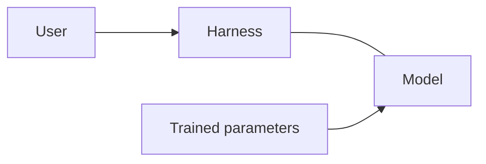
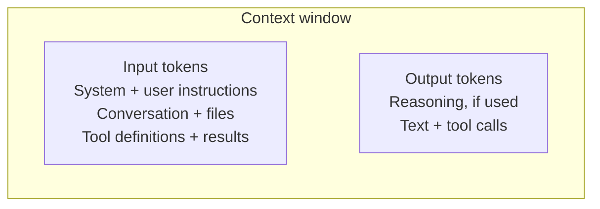
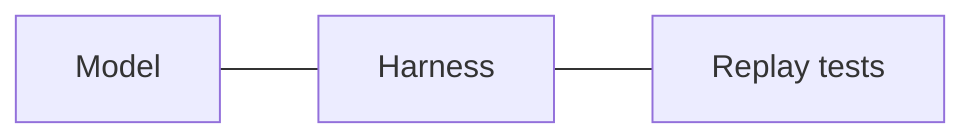
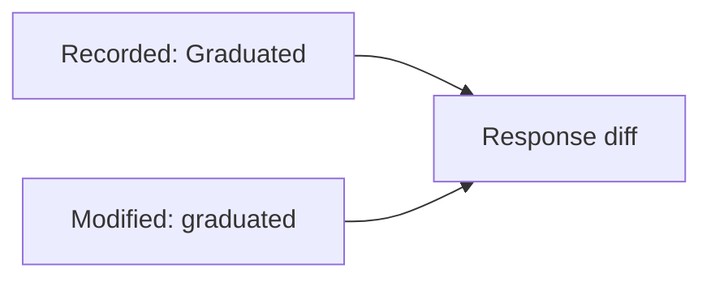

# How runtime feedback improves AI coding

An AI coding tool can write a change and a passing test that both get the API wrong. Recorded traffic gives it real requests and responses to work from. Replay checks what the changed code actually does with them.

## The model and the harness



The model generates code using patterns learned during training and the context you give it now. It can reason about how code should behave. That reasoning can still be wrong, and generating code does not run it.

The **harness** is the software around the model. It combines your request with instructions, relevant files, and tool results. It manages the conversation and executes allowed tool calls. The model proposes edits and commands; the harness applies edits, runs commands, and sends the results back. Together, they form the coding agent.

Reading an API client tells the model how the client expects a response to look. It does not tell the model what the API returns today, what is in the database, or which requests time out. The model can request commands through the harness to check those assumptions. Until it does, those details may be assumptions.

## What the context window holds



The context window is the token budget for one model request. Tokens are chunks of text or code; images and other supported inputs also use tokens. **Input and generated output must fit within the model's context limit.** The diagram shows the parts of that budget, not their relative sizes.

Input includes the system and developer instructions, your request, and the conversation so far. Your goals, constraints, examples, and attached files give the model user context. Selected source code, documentation, and traffic recordings add details about the application. Tool definitions tell the model what it can call; tool results tell it what those calls returned.

Output includes the model's reply, generated code, and requests to call tools. For reasoning models, reasoning tokens also use the budget even when you cannot see them. Models can have a separate output limit too. More input leaves less room for output within the total context limit.

The harness assembles these inputs. A file on disk uses no context space until its contents are supplied. After a tool runs, the harness includes the result in the next request. A failed replay therefore becomes new input that can change the model's next edit. The conversation grows across these requests, so the harness may need to select, summarize, or drop older material.

Traffic shares this budget with everything else. It neither enlarges the window nor retrains the model. See the context-window docs from [OpenAI](https://developers.openai.com/api/docs/guides/conversation-state#managing-the-context-window) and [Anthropic](https://docs.claude.com/en/docs/build-with-claude/context-windows).

## How traffic and test results help

Before editing, the model can ask the harness to read captured requests and responses. These show actual field names, value types, and calls between services. For example, a response might contain a null value where the model expected a string. That example gives it a reason to handle the null case.

After editing, the harness can run the application with recorded responses as mocks and replay requests against it. A failed comparison tells the model what changed. That result enters the next request, so the model can use it to diagnose the failure and revise the code.



*The harness connects the model to execution. Test results become context for the next decision.*

The harness runs replay and collects its response comparisons. The model reads that feedback and decides whether another edit is needed. See how tool results are returned in [OpenAI](https://developers.openai.com/api/docs/guides/function-calling) and [Anthropic](https://docs.claude.com/en/docs/agents-and-tools/tool-use/overview).

## An example in mock-lab

The [Go app](languages/go/main.go) groups projects by maturity at `GET /api/stats`. Its [recorded API response](lab/proxymock/recording/localhost/2026-06-25_18-56-37.062363Z.md) contains:

```json
{"by_maturity":{"Graduated":16,"Incubating":5,"Sandbox":3},"total":24}
```

Suppose an agent refactors the code and lowercases those keys. It also writes a test expecting `"graduated"`. The test passes, but a client looking for `"Graduated"` breaks.



Reading the recording would show the existing casing before the edit. Replay could catch the change afterward, even though both versions return HTTP 200.

To run the recorded cases, start the app from `languages/go`:

```bash
proxymock mock --in ../../lab/proxymock/recording -- go run .
```

In a second terminal, also from `languages/go`, run:

```bash
proxymock replay --in ../../lab/proxymock/recording --test-against http://localhost:8080
```

Replay writes results for each request to `replay-verdict.json` in its output directory. With the hypothetical lowercase change, the body diff would show a removed `Graduated` key and an added `graduated` key. The agent now has a specific failure to fix. The unchanged app should not show that difference.

## Choose useful traffic

Keep the full recording on disk. Give the model relevant RRPairs (proxymock's request/response pair files) and test results as needed. Different payloads and failure cases add useful coverage; repeated copies of the same successful request add little.

Replay checks the cases you recorded. It cannot prove the original behavior was correct or cover every production condition. Keep tests for the intended behavior, and use logs, traces, or profiles when responses alone cannot explain a failure. Remove credentials and personal data before sharing captures with a model.
