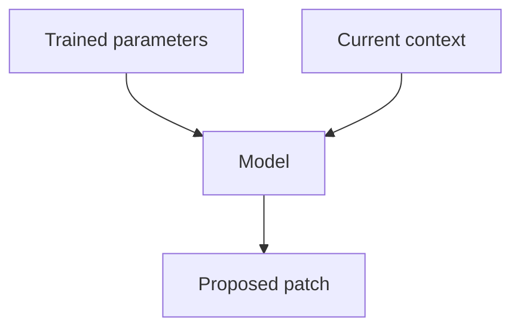
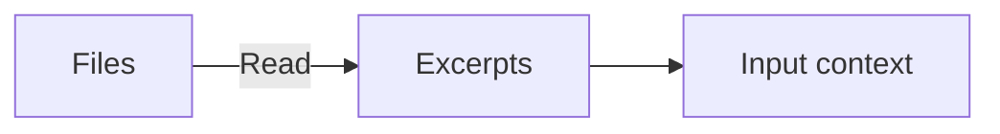
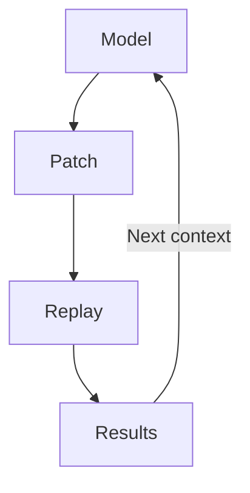
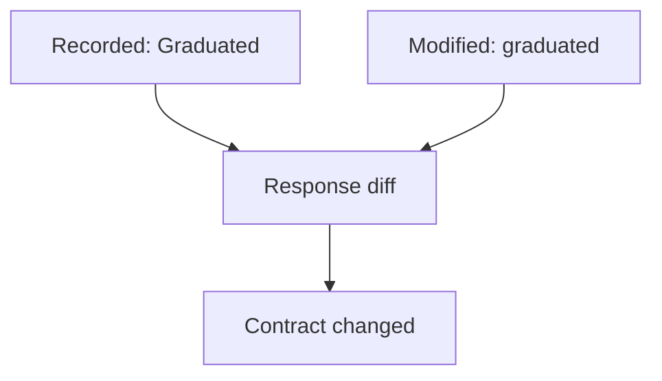

# How runtime feedback improves AI coding

A coding agent can produce a change that compiles and passes its own unit tests while breaking an API response used by an existing client. The implementation and the tests may share the same incorrect assumption. Recorded traffic gives the agent evidence of the existing interface. Replaying that traffic against the changed application tests whether the assumption survives execution.

## What the model knows before anything runs



*The model generates a patch from learned patterns and supplied context. Execution is a separate step.*

A language model generates tokens using patterns encoded in its trained parameters and the context supplied with the current request. Those patterns support reasoning about control flow, types, algorithms, and likely program behavior. It does not normally look up your code in its training data and compare the two. Generating an explanation or a patch also does not execute the application. Token generation produces a candidate answer, not a measurement of runtime behavior.

The distinction matters at service boundaries. Reading a client implementation can reveal which URL it calls and how it parses JSON. It cannot establish which payloads a deployed dependency actually returns, which configuration is active, or how the system behaves under a particular workload. Even complete source code does not supply the current database state, network conditions, or external service behavior.

A coding agent combines the model with tools that can read files, modify code, and execute commands. It can obtain runtime evidence by using those tools. Its conclusions are limited by the code and observations actually supplied to the model: a file it has not read, an error path it has not exercised, and a log it has not retrieved cannot directly inform the current response.

## The context window is the interface for new evidence



*Only content supplied to the model consumes input tokens. A recording on disk is not automatically in context.*

The context window is the model's bounded token budget for one inference request. Tokens encode text, including code and tool output. Input, generated output, and reasoning tokens where applicable must fit within the model's limits. The input can contain:

| Context content | What it contributes |
| --- | --- |
| Task, requirements, and instructions | The intended change and constraints |
| Selected source files and documentation | Implementation details and declared contracts |
| Conversation and prior tool results | Decisions, observations, and work already performed |
| Recorded requests and responses | Examples of actual inputs, outputs, and dependency interactions |
| Execution results | Compiler errors, failed assertions, response differences, logs, or measurements |

The model's trained parameters are separate from this context. Supplying a recording changes the input used to generate the next response; it does not retrain the model or expand its context limit. A larger context window allows more evidence to be included, but does not collect that evidence automatically. Files remain outside the window until their contents are supplied, such as through a file-read result. As a session grows, the tool may select, summarize, or compact prior context to stay within its limits. See [OpenAI's context-window documentation](https://developers.openai.com/api/docs/guides/conversation-state#managing-the-context-window) and [Anthropic's](https://docs.claude.com/en/docs/build-with-claude/context-windows).

## Traffic helps before and after a code change

**Before the change, traffic supplies concrete examples.** A captured response can establish that a field is nullable, an identifier is a string, or an API returns a bare array. A request sequence can expose a dependency between a returned token and a later authorization header. These observations constrain the model's interpretation of the interface and help it avoid inventing fixtures from conventions alone. Providing relevant examples is a form of in-context learning: the model can use them without changing its trained parameters. [OpenAI's prompting guidance](https://developers.openai.com/api/docs/guides/prompt-engineering#few-shot-learning) describes how input/output examples guide generation.

**After the change, execution supplies feedback.** proxymock can serve captured downstream responses and replay recorded inbound requests against the modified application. The test runs outside the language model. Its response comparisons and failures can be returned as tool output and included in the next model request. The agent then has a specific discrepancy to investigate, rather than only its earlier explanation of why the patch should work.



*Execution results return to the model as new evidence. Replay runs against the modified application.*

The coding tool executes the model's requested actions and returns their results. This feedback loop is the mechanism that makes new runtime observations available to the model. It changes the evidence for the next decision; it does not guarantee the model will interpret that evidence correctly. See [OpenAI's tool-call execution flow](https://developers.openai.com/api/docs/guides/function-calling) and [Anthropic's tool-use overview](https://docs.claude.com/en/docs/agents-and-tools/tool-use/overview).

## A concrete example in mock-lab

The [Go implementation](languages/go/main.go) of `GET /api/stats` fetches `/v1/projects` and groups projects by the `maturity` field. The [recorded downstream response](lab/proxymock/recording/demo-api.trafficreplay.com/2026-06-25_18-56-36.852193Z.md) uses values such as `"Graduated"`. The [recorded application response](lab/proxymock/recording/localhost/2026-06-25_18-56-37.062363Z.md) contains:

```json
{"by_maturity":{"Graduated":16,"Incubating":5,"Sandbox":3},"total":24}
```

Consider a hypothetical refactor that converts maturity values to lowercase. An agent might also generate a unit test expecting `"graduated"`, so that test passes. But the response field names have changed for existing clients.



*Both responses can be HTTP 200. Comparing response bodies exposes the changed key.*

Reading the recordings before editing exposes the existing casing. Running the modified app against the captured downstream data and comparing the replayed response body exposes the regression afterward. From `languages/go`:

```bash
proxymock mock --in ../../lab/proxymock/recording -- go run .
proxymock replay --in ../../lab/proxymock/recording --test-against http://localhost:8080
```

Replay writes a per-pair verdict to `replay-verdict.json` in its output directory, and the diff for the stats pair shows the problem: `by_maturity.Graduated` is missing and `by_maturity.graduated` has appeared. Both responses can still be HTTP 200, so a status-only check would miss it. That difference gives the agent a concrete reason to revisit the normalization and preserve the existing API contract, unless the requirements explicitly call for changing it.

This is an illustrative failure scenario using the committed fixtures, not a benchmark result or a bug reproduced for this document.

## More feedback requires representative cases

Adding duplicate successful requests does little to reduce uncertainty. Select traffic that covers the endpoints, response variants, and failures relevant to the change. Keep the full recording on disk; supply selected RRPairs (proxymock's request/response pair files) and concise reports to the model, retrieving full details when needed.

A recording represents observed behavior from one environment and time. Replay checks the selected cases under the configured comparisons. It cannot establish that the original behavior was correct, reproduce every production condition, or cover failures that were never captured. Use requirements and explicit assertions to define correctness, and add logs, traces, profiles, or targeted tests when traffic alone cannot explain a failure. Redact credentials and personal data before supplying captures to a model.
