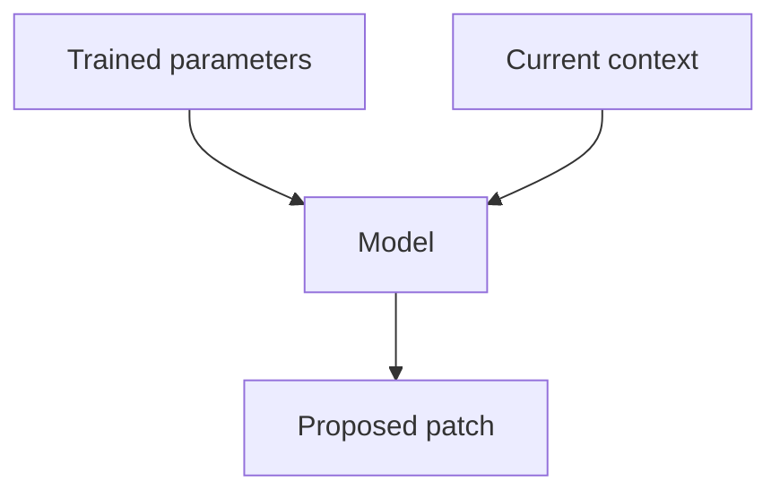
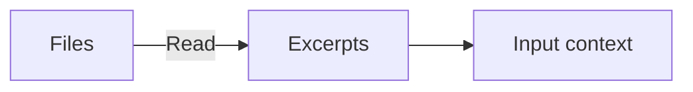
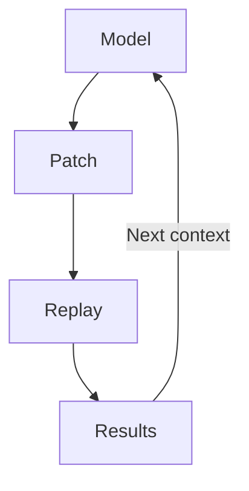
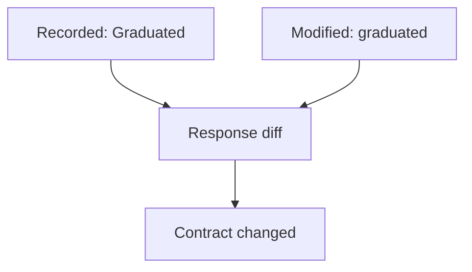

# How runtime feedback improves AI coding

An AI coding tool can write a change and a passing test that both get the API wrong. Recorded traffic gives it real requests and responses to work from. Replay checks what the changed code actually does with them.

## What the model knows



The model generates code using patterns learned during training and the context you give it now. It can reason about how code should behave. That reasoning can still be wrong, and generating code does not run it.

Reading an API client tells the model how the client expects a response to look. It does not tell the model what the API returns today, what is in the database, or which requests time out. A coding tool can run commands and read the results to answer those questions. Until it does, those details may be assumptions.

## What the context window holds



The context window limits how much the model can process at once. It is measured in tokens: chunks of text or code. Your instructions, conversation, files read by the tool, and command results all take up space. The budget also needs room for the response and, for reasoning models, reasoning tokens.

A file sitting in the repository is not automatically in context. The tool has to read it and supply its contents to the model. The same goes for recordings and test results.

Adding traffic gives the model more information for the current task. It does not retrain the model or enlarge the window. When the window fills, the tool may summarize or drop older material. See the context-window docs from [OpenAI](https://developers.openai.com/api/docs/guides/conversation-state#managing-the-context-window) and [Anthropic](https://docs.claude.com/en/docs/build-with-claude/context-windows).

## How traffic and test results help

Before editing, the tool can read captured requests and responses. These show actual field names, value types, and calls between services. For example, a response might contain a null value where the model expected a string. That example gives it a reason to handle the null case.

After editing, the tool can run the application with recorded responses as mocks and replay requests against it. A failed comparison tells the model what changed. That result enters the next request, so the model can use it to diagnose the failure and revise the code.



The application runs outside the model. The coding tool returns its results to the model as context. This is how the agent gets feedback about its work. See how tool results are returned in [OpenAI](https://developers.openai.com/api/docs/guides/function-calling) and [Anthropic](https://docs.claude.com/en/docs/agents-and-tools/tool-use/overview).

## An example in mock-lab

The [Go app](languages/go/main.go) groups projects by maturity at `GET /api/stats`. Its [recorded API response](lab/proxymock/recording/localhost/2026-06-25_18-56-37.062363Z.md) contains:

```json
{"by_maturity":{"Graduated":16,"Incubating":5,"Sandbox":3},"total":24}
```

Suppose an agent refactors the code and lowercases those keys. It also writes a test expecting `"graduated"`. The test passes, but a client looking for `"Graduated"` breaks.



Reading the recording would show the existing casing before the edit. Replay could catch the change afterward, even though both versions return HTTP 200.

To run the recorded cases, start the app from `languages/go`:

```bash
proxymock mock --in ../../lab/proxymock/recording -- go run .
```

In a second terminal, also from `languages/go`, run:

```bash
proxymock replay --in ../../lab/proxymock/recording --test-against http://localhost:8080
```

Replay writes results for each request to `replay-verdict.json` in its output directory. With the hypothetical lowercase change, the body diff would show a removed `Graduated` key and an added `graduated` key. The agent now has a specific failure to fix. The unchanged app should not show that difference.

## Choose useful traffic

Keep the full recording on disk. Give the model relevant RRPairs (proxymock's request/response pair files) and test results as needed. Different payloads and failure cases add useful coverage; repeated copies of the same successful request add little.

Replay checks the cases you recorded. It cannot prove the original behavior was correct or cover every production condition. Keep tests for the intended behavior, and use logs, traces, or profiles when responses alone cannot explain a failure. Remove credentials and personal data before sharing captures with a model.
