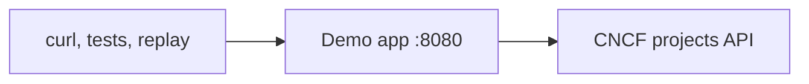

# mock-lab

Demo apps for the [proxymock](https://docs.speedscale.com/proxymock/) quickstart — the same
small app in ten languages. Each one calls a CNCF projects API as its downstream; proxymock
records that call, then mocks it so the app runs and tests with **no network**.

This repo also holds [other labs](labs/) and the [agent tutorial app](tutorial/), and is the
fixture for the [proxymock agent skills](https://github.com/speedscale/skills) that reuse the same recordings.

Recorded traffic gives coding agents real API examples to inspect, and replaying it exposes assumptions the code got wrong. See [how runtime feedback improves AI coding](AI-CONTEXT.md).

## Try it in GitHub Codespaces

One click — all ten runtimes and the `proxymock` CLI are preinstalled. Run
`proxymock init --api-key <key>` once to activate it (free key at
[app.speedscale.com/signup](https://app.speedscale.com/signup)).

## Pick a language

Each app listens on `:8080` (`PORT`) and calls the downstream at `DOWNSTREAM_URL`
(default `https://demo-api.trafficreplay.com`). How to run, record, mock, and
replay is in that language's README. Java, Kotlin, and Node need extra proxy
setup; the README for that language says how.

- [Go](languages/go/README.md)
- [Node.js](languages/node/README.md)
- [Python](languages/python/README.md)
- [Java](languages/java/README.md)
- [Kotlin](languages/kotlin/README.md)
- [Ruby](languages/ruby/README.md)
- [.NET](languages/dotnet/README.md)
- [C++](languages/cpp/README.md)
- [PHP](languages/php/README.md)
- [Rust](languages/rust/README.md)

## Projects and orders

Every language serves the same two kinds of calls. **Project** calls list and look up CNCF projects. **Order** calls mint a token, create an order for a project, and read that order back. The token and the order id are new on every call.

The downstream contract is [`lab/openapi.yaml`](lab/openapi.yaml). A shared recording in [`lab/proxymock/`](lab/proxymock/) includes the smart-replace blueprint that re-chains those two ids, so you can mock and replay offline against any language. Each language directory also keeps its own capture under `proxymock/recording`.

## Where to go next

| You want | Go here |
| --- | --- |
| Run, record, mock, or replay one language | that language's README, above |
| Drive the calls from a script or a page | [`lab/`](lab/README.md) — `lab/tests/run_tests.sh` and the dashboard |
| Companion scenarios (profiles, traces, logs, chaos) | [`labs/`](labs/) |
| The agent tutorial app | [`tutorial/`](tutorial/) |
| Agent skills | [github.com/speedscale/skills](https://github.com/speedscale/skills). They still use `lab/proxymock/recording`. See [`skills/README.md`](skills/README.md). |
