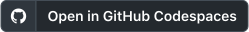

# mock-lab

Runnable apps and exercises for learning [proxymock](https://docs.speedscale.com/proxymock/). Fork this repository to change an app, record its traffic, and test your changes by replaying that traffic.

## Start with a small app

Pick a language. Each app runs on port 8080 and calls the same CNCF projects API. Its README walks through running, recording, mocking, and replaying it. Each app includes a complete proxymock workspace for trying the recorded examples offline.

| Language | Example |
| --- | --- |
| Go | [languages/go](languages/go/README.md) |
| Node.js | [languages/node](languages/node/README.md) |
| Python | [languages/python](languages/python/README.md) |
| Java | [languages/java](languages/java/README.md) |
| Kotlin | [languages/kotlin](languages/kotlin/README.md) |
| Ruby | [languages/ruby](languages/ruby/README.md) |
| .NET | [languages/dotnet](languages/dotnet/README.md) |
| C++ | [languages/cpp](languages/cpp/README.md) |
| PHP | [languages/php](languages/php/README.md) |
| Rust | [languages/rust](languages/rust/README.md) |

Start with the [Node app](languages/node/README.md), which needs only Node and proxymock. Fork this repo on GitHub, clone your fork, and enter the app directory:

```shell
git clone https://github.com/<your-user>/mock-lab.git
cd mock-lab/languages/node
```

Install proxymock and run `proxymock init --api-key <key>` first. Get a free key at [app.speedscale.com/signup](https://app.speedscale.com/signup). Follow the app README for runtime and proxy setup. Record a small session or use the committed recording, then ask the installed skills to create the tests. Start your editor or coding agent in the app directory; new recordings and results stay in that app's `proxymock/` workspace.

### GitHub Codespaces

[](https://codespaces.new/speedscale/mock-lab)

The runtimes and proxymock CLI are preinstalled. Activate proxymock with your API key, then enter `languages/node` or another language directory. To work in your own fork, create a Codespace from that fork.

## Work through the agent tutorial

The [tutorial app](tutorial/README.md) is a CNCF swag shop with an HTTP dependency and Postgres. Go, Java, Python, and Node implementations let an agent record traffic, tune mocks and tests, and run regression and performance tests. Start with the tutorial README for prerequisites and database setup.

## Try a specific lab

The [lab catalog](labs/README.md) has exercises for profiles, metrics, traces, logs, SQL query attribution, network policy, eBPF instrumentation, chaos, and contract testing. Each lab has its own setup and working directory.

## Shared tools and recordings

The [shared tools](shared/README.md) provide a reference downstream API, a dashboard, and a traffic driver for the language apps. Their downstream contract is [shared/openapi.yaml](shared/openapi.yaml).

The root [proxymock workspace](proxymock/README.md) holds the reusable baseline recording, app contract, smart-replace blueprint, and schema-coverage test configuration. Run its examples from the repository root. The language workspaces hold captures from their own runtimes.

## Agent skills

Install the [Speedscale agent skills](https://github.com/speedscale/skills) into your agent:

```shell
npx skills add speedscale/skills
```

From the app directory, ask your agent: "Use this recording to create and run regression, contract, load and chaos tests. Show proposed expectations and budgets for review before saving them." Then ask it to use the results and OpenAPI schema to improve coverage and nonfunctional checks. The skills choose the scenarios and native commands from the app and traffic; this repository supplies their inputs.

The skills' proof scripts use this repository's root recording:

```shell
MOCK_LAB_DIR="$PWD" /path/to/skills/skills/quality-loop/scripts/prove-quality-loop.sh
```

See [how runtime feedback improves AI coding](AI-CONTEXT.md) for using recordings as context and replay as a check on code changes.
